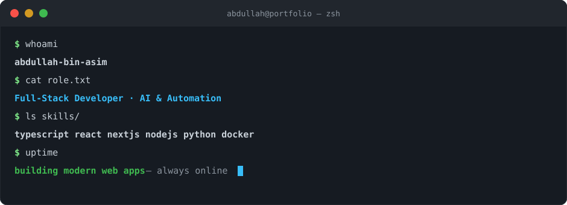
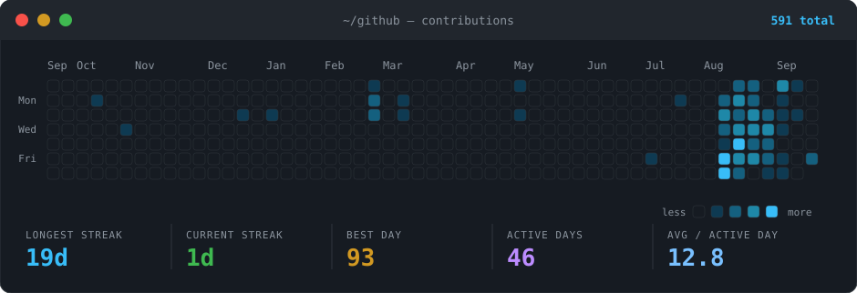
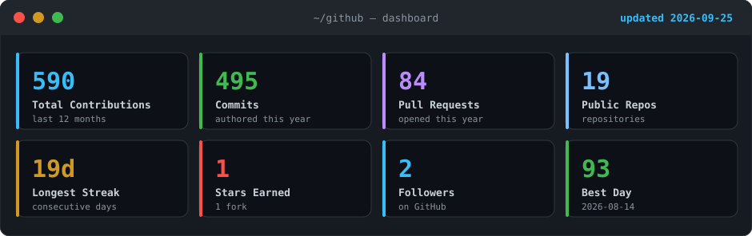
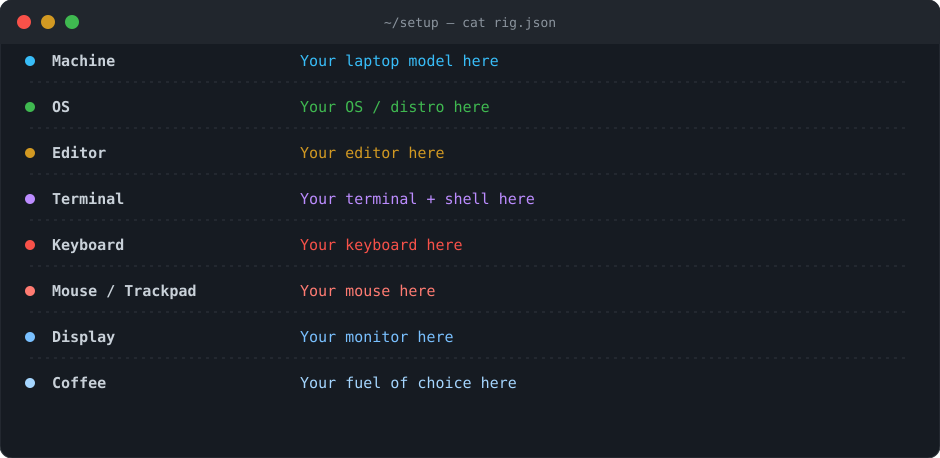

  

  

  

    
    
    
     
    
  

---

### 👋 About Me

<picture>
  <source media="(prefers-color-scheme: dark)" srcset="./assets/terminal.svg" />
  
</picture>

- 🔭 I’m currently working on **Full-Stack Web Applications & AI-powered tools**
- 🌱 I’m currently learning & exploring **Agentic AI, Cloud Architecture & DevOps**
- 💬 Ask me about **JavaScript, TypeScript, React, Node.js, Python, Databases**
- ⚡ Fun fact: _Writing clean code and automating everything possible!_
- 📍 Open to **full-time roles & freelance collaborations**

---

### 🚀 Featured Projects

<table>
  <tr>
    <td width="50%">
      <h3><a href="https://four-ai-dev.vercel.app/">FourAI</a></h3>
      
AI-powered voice &amp; image generation platform.

      
      
      
       
      <a href="https://four-ai-dev.vercel.app/">🔗 Live</a> ·
      <a href="https://github.com/abdullahasim1/four-ai-ai-powered-voice-image-generation-platform">💻 Code</a>
    </td>
    <td width="50%">
      <h3><a href="https://thedevrox.com">DevRox Agency</a></h3>
      
Production agency website with modern animations.

      
      
      
       
      <a href="https://thedevrox.com">🔗 Live</a> ·
      <a href="https://github.com/abdullahasim1/Agency-Site">💻 Code</a>
    </td>
  </tr>
  <tr>
    <td width="50%">
      <h3><a href="https://job-recuitment.vercel.app">Job Recruitment</a></h3>
      
Full-stack job portal — listings, applications &amp; auth.

      
      
      
       
      <a href="https://job-recuitment.vercel.app">🔗 Live</a> ·
      <a href="https://github.com/abdullahasim1/Job-Recuitment">💻 Code</a>
    </td>
    <td width="50%">
      <h3><a href="https://abdullah-asim-dev.vercel.app">Portfolio</a></h3>
      
Personal portfolio &amp; blog built with modern JS stack.

      
      
      
       
      <a href="https://abdullah-asim-dev.vercel.app">🔗 Live</a> ·
      <a href="https://github.com/abdullahasim1/abdullah-portfolio">💻 Code</a>
    </td>
  </tr>
</table>

> 📂 Browse everything on my [GitHub profile →](https://github.com/abdullahasim1?tab=repositories)

---

### 🛠️ Tech Stack & Skills

    
  

 

  
  
  
  
  
  
  

 

### 🎯 Skill Proficiency

  <picture>
    <source media="(prefers-color-scheme: dark)" srcset="./assets/skills.svg" />
    
  </picture>

---

### 🐍 Contribution Snake

  <picture>
    <source media="(prefers-color-scheme: dark)" srcset="https://raw.githubusercontent.com/abdullahasim1/abdullahasim1/output/github-snake-dark.svg" />
    
  </picture>

---

### 🏆 GitHub Trophies

  

---

### 📈 Contribution Activity

  <picture>
    <source media="(prefers-color-scheme: dark)" srcset="./assets/contributions.svg" />
    
  </picture>

 

<b>📉 Line graph (click to expand)</b>

 

  

---

### 📊 GitHub Analytics & Streak

  <picture>
    <source media="(prefers-color-scheme: dark)" srcset="./assets/dashboard.svg" />
    
  </picture>

 

  <table border="0">
    <tr>
      <td>
        
      </td>
      <td>
        
      </td>
    </tr>
  </table>
   
  

---

### 🖥️ My Setup

  <picture>
    <source media="(prefers-color-scheme: dark)" srcset="./assets/setup.svg" />
    
  </picture>

---

### 💼 Open to Opportunities

I'm currently available for **full-time roles** and **freelance projects** — feel free to reach out!

 

⚡ Built with ❤️ by Abdullah Bin Asim

  

